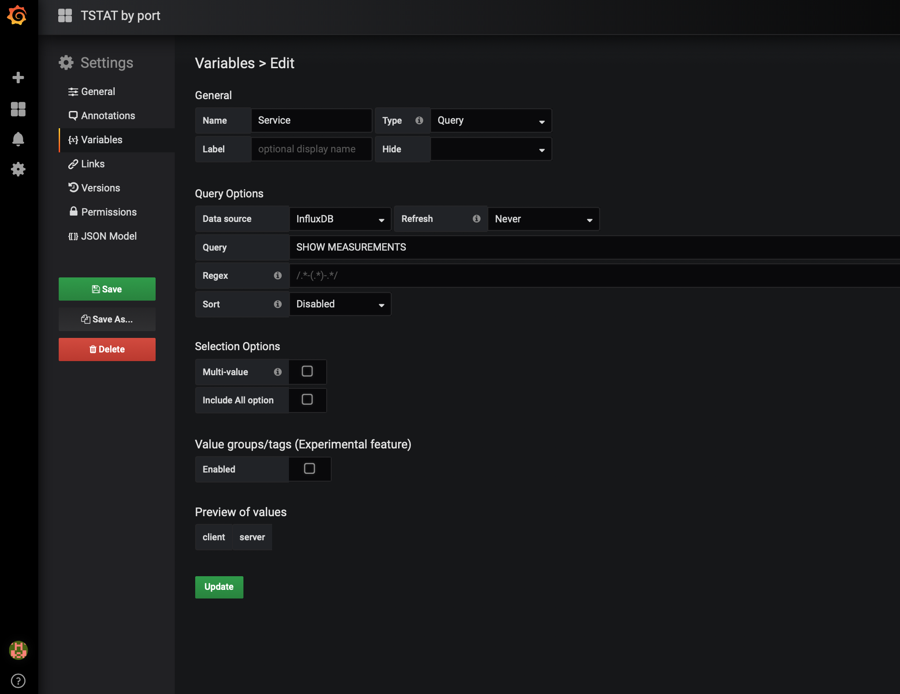
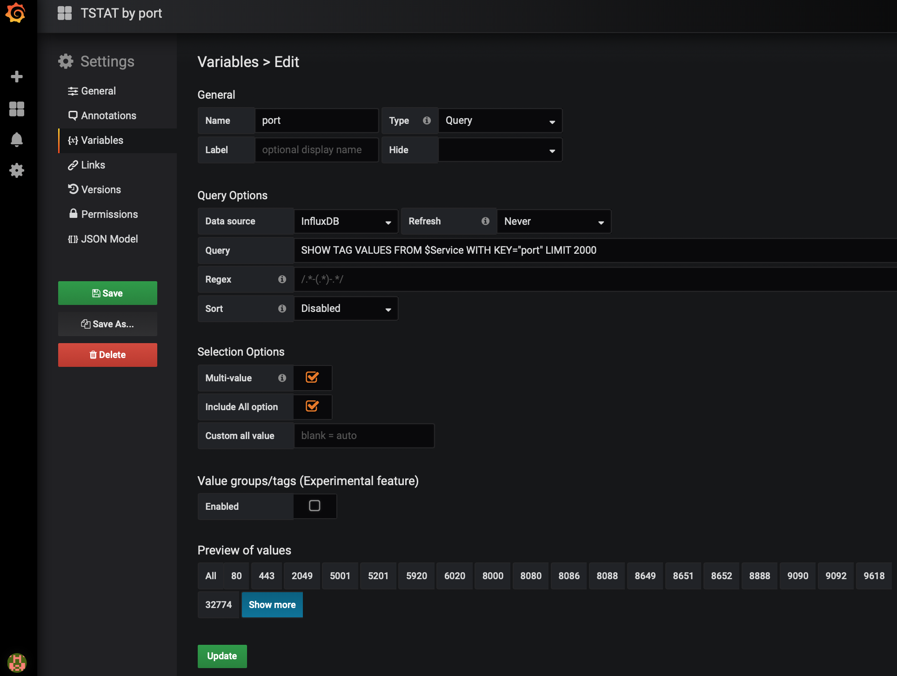
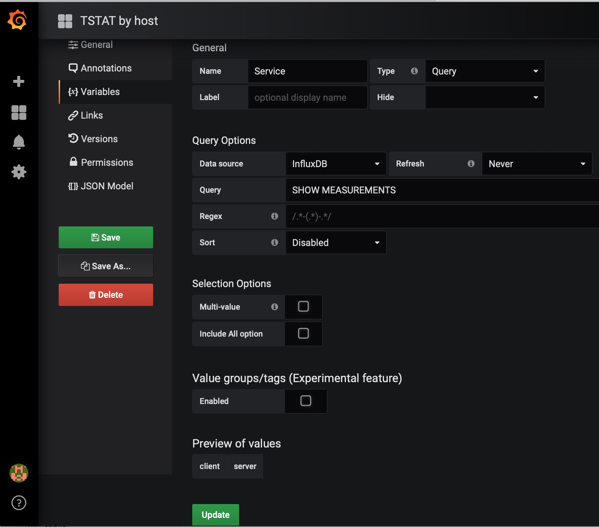
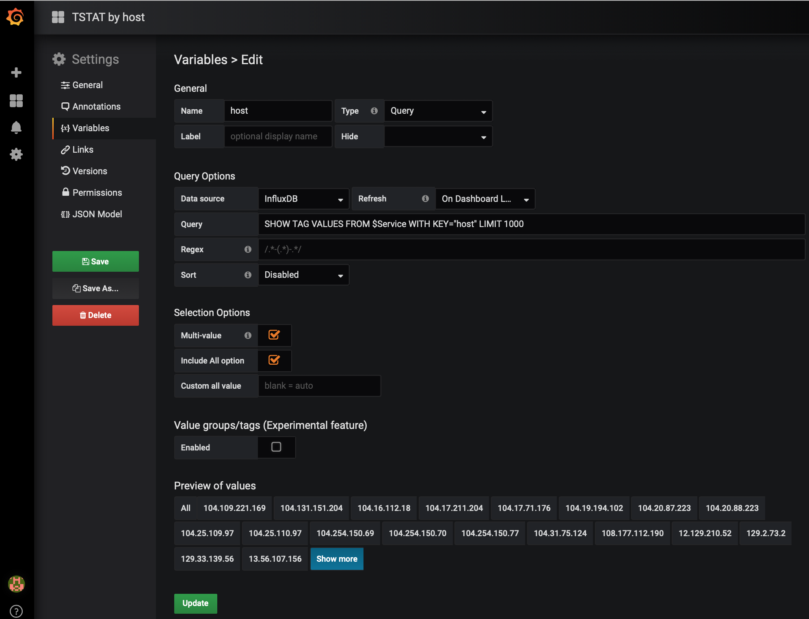

#### Grafana admin user

Upon install, grafana has default settings:
```txt
user: admin
password: admin
```

After logging first time as a user admin using web interface (point browser to pc-170.calit2.optiputer.net:3000), 
can reset admin passwd.

When a password is lost can reset a password using grafana sqlite database.

As root connect to the grafana sqlite database:
```bash
# sqlite3 /var/lib/grafana/grafana.db 
```
At the `sqlite>` prompt execute 
```bash
sqlite> update user set password = '59acf18b94d7eb0694c61e60ce44c110c7a683ac6a8f09580d626f90f4a242000746579358d77dd9e570e83fa24faa88a8a6', salt = 'F3FAxVm33R' where login = 'admin';
sqlite> .exit
```

The above command in sqilte resets the password to a default admin (with a default salt).
Login as admin/admin at the web interface and follow instructionson the screen to  update  and reset a password
to a new one.

#### Dashboard Settings

For each dashboard need to set variables.  The setings for dashboard are located on the top right hand bar


Click on settings and then choose `Variables` from the menu

1. Dashboard `Tstat by port`

   There are 2 variables: service and port.

   Variable `service` configuration

   

   Variable `port` configuration

   

2. Dashboard `Tstat by host`

   There are 2 variables: service and host.

   Variable `service` configuration

   

   Variable `host` configuration

   
