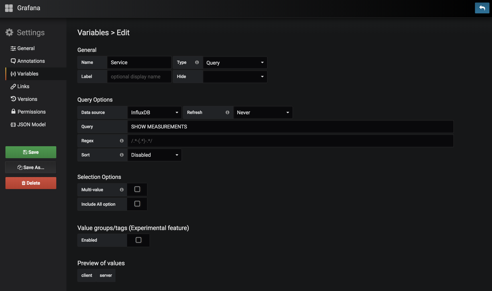
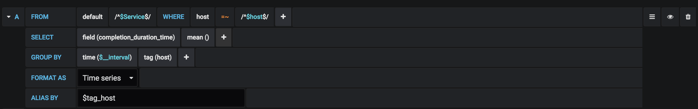
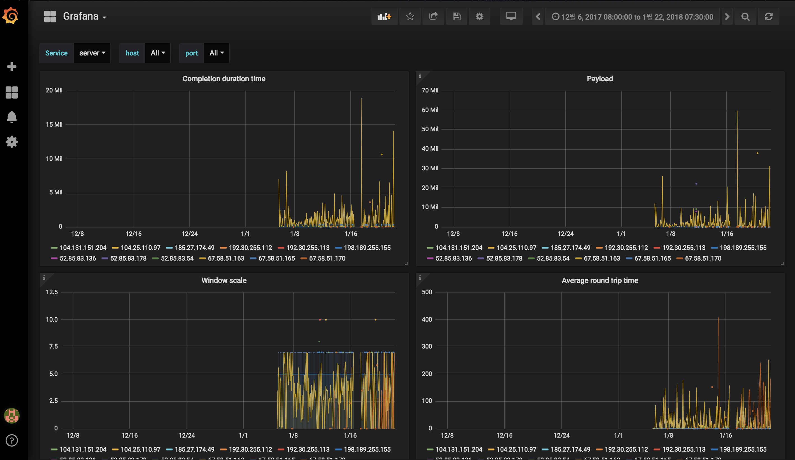
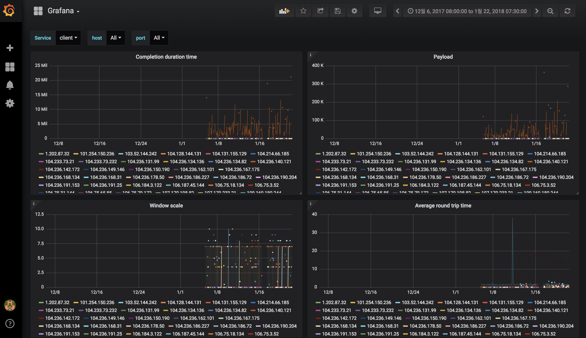

## 2019 JAN WEEK FIFTH

#### Things to do

- [x] Divide the graphs by server and client.

	- Store datas into each service's measurement.
	
	I store the server's data into 'server' measurement in influxDB, the client's data into 'client' measurement. So, When I write 'SHOW MEASUREMENTS' command, the result text are 'server' and 'client'.

	- Add variables 'Service'.

	To enable to choose server or client, add the measurement (server, client) as variable. The setting is like below picture.
	

	- Modify query.

	I stored data into each measurements as service name, so, have to modify the 'FROM' portion of the query statement. Grafana have to extract data from which user choose on 'Service'. The example in 'completion duration time' is below picture.

	

RESULT: I stored the data from 2018_01_05_19_27 to 2018_02_05_20_40 as test.

	- Server
	

	-Client
	
	 	
- [ ] Make user can view the graph to select a host or port.
- [ ] Fix the bug that all data isn't stored in influxDB completely.

#### Things to do next week

- Check that bug is fixed completely.
- Pull & Request to master branch. 
