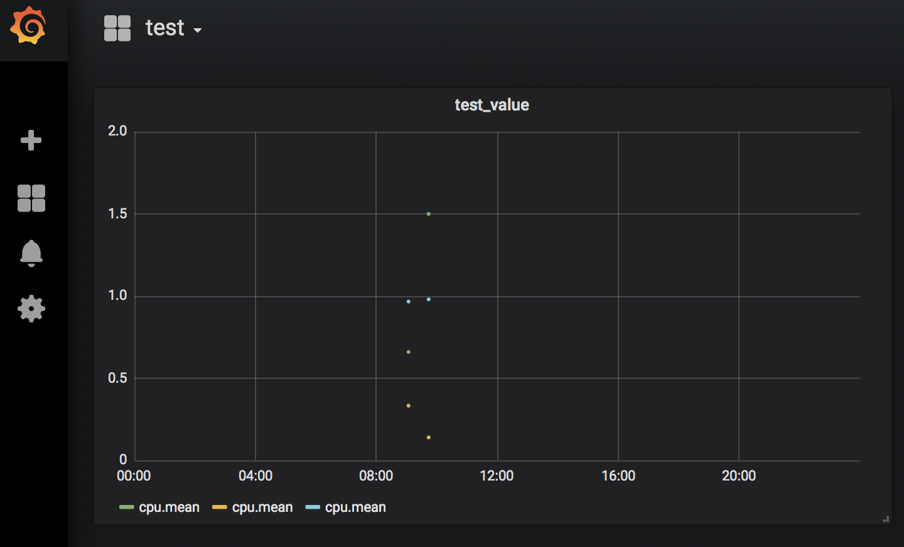

## 2019 JAN WEEK 03

#### Things to do

- [x] Distribute how to process errors more exact.

	- In previous code, the reason that there were many errors is that the error was handled when port number of server or client was 22.
	So, when port number is 22, just stop processing current line and start next line.

	- The only situation that causes an error is short length in log_tcp_complete.
	If the number of elements in log_tcp_complete file is less than 130, it is strange log. So, it is processed as an error.

	- The logs that are really problematic are stored in the log_tcp_nocomplete files.

	- Print the error-induced line number and the log file's name.

RESULT : There are two lines that the length is short in the log_tcp_complete files from 2017_12_07 to 2018_02_21.
 
- [x] Study how to use Grafana.

	- First, I try to install and use Grafana on local (Mac). I referenced the Grafana site(https://grafana.com/grafana/download). I installed Grafana in local with brew command. And I connected to port number 3000.

	- Test it with temporary data in influxDB. I added the data source which is connected with local influxDB and created a dashboard that extract some value from data the source.

	

#### Things to do next week

- Move to Grafana.
- Study how increase security when accessing Grafana.
