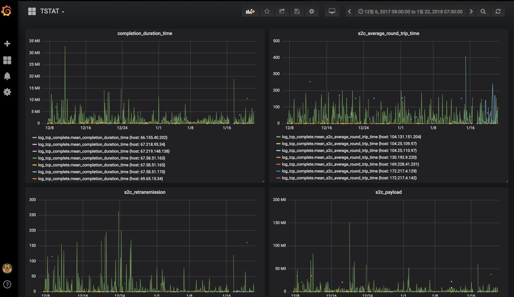
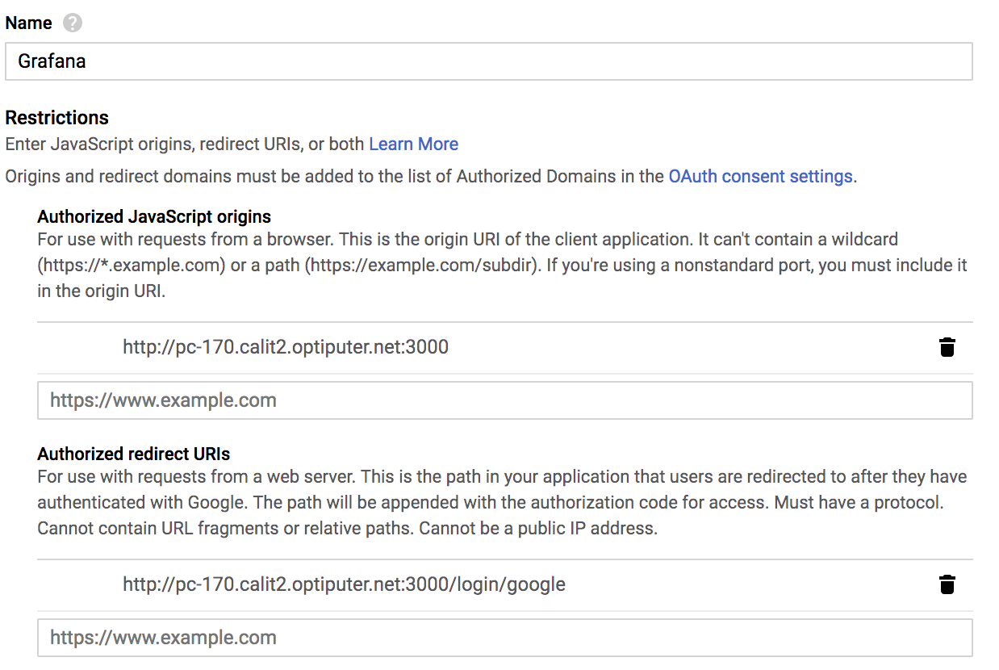

## 2019 JAN WEEK 04

#### Things to do

- [x] Move to Grafana.

	- Install Grafana with Grafana documentation reference.(http://docs.grafana.org/installation/rpm/)
	
	Download the rpm through wget command and run the rpm. Then, It is displayed as the below.

	<pre><code>Preparing...                ########################################### [100%]
	   1:grafana                ########################################### [100%]
	### NOT starting grafana-server by default on bootup, please execute
 	 sudo /sbin/chkconfig --add grafana-server
	### In order to start grafana-server, execute
	 sudo service grafana-server start
	POSTTRANS: Running script</pre></code>

	Type the two commands in order, and run Grafana (sudo service grafana-server start).

	- There was some problem with using Grafana from external.
	
	I used 'UCSD-GUEST' WiFi. In Chronograf, It worked well although I tried to directly access host's port number 8080. But, When I finished installing Grafana and tried to access to port number 3000 from web browser, It occured an error which is 'ERR_CONNECTION_TIMED_OUT'.
	It needs to do ssh port forwarding. I set my local's port number 3000 to pc-170.calit2.optiputer.net's port number 3000.
	<pre><code>ssh -L 3000:localhost:3000 chojpsh1@pc-170.calit2.optiputer.net</pre></code>

	Then, I connect 'localhost:3000' from web browser and It works well with accessing pc-170.calit2.optiputer.net:3000.

	- Add Data Sources in Grafana.
	
	To add data sources, There need some informations (InfluxDB's url, name of database to use, ID and password to access to influxDB). Type them properly and click 'Save&Test' Button. If 'Data source is working' statement is displayed, it's a success. First, When I tried to add data sources in Safari, I failed to add continously. But, I swithced the browser Safari to Chrome and did it. Then, there wasn't any error.

	- Create Dashboard.
	
	I tried to move queries which is used in Chrnograf to Grafana. But, I faced an error 'error parsing query: found :'. In Chronograf query, the format of 'GROUP BY interval' is ':interval:'. But, In Grafana, It is 'time($__interval)'. So, It is all done by carefully moving it with format of interval.

		

- [x] Study how to increase security when accessing Grafana.

	- Use Google OAuth 2.0
	
	There's no need to sign up in Grafana and type directly id and password of google, So, Google OAuth 2.0 provides safe usage.How to use Google OAuth 2.0 with Grafana is described in Grafana documentation(http://docs.grafana.org/auth/google/).
	First, I'm issued a client key and ID for Google OAuth. The Authorized Javascript Origins is 'http://pc-170.calit2.optiputer.net:3000'. And the Authorized Redirect URLs is 'http://pc-170.calit2.optiputer.net:3000/login/google'. And the type is web application.

	

#### Things to do next week

- Restrict access if user is not allowed.
- Measure and visualize performance which is calculated with data in log_tcp_complete file.
